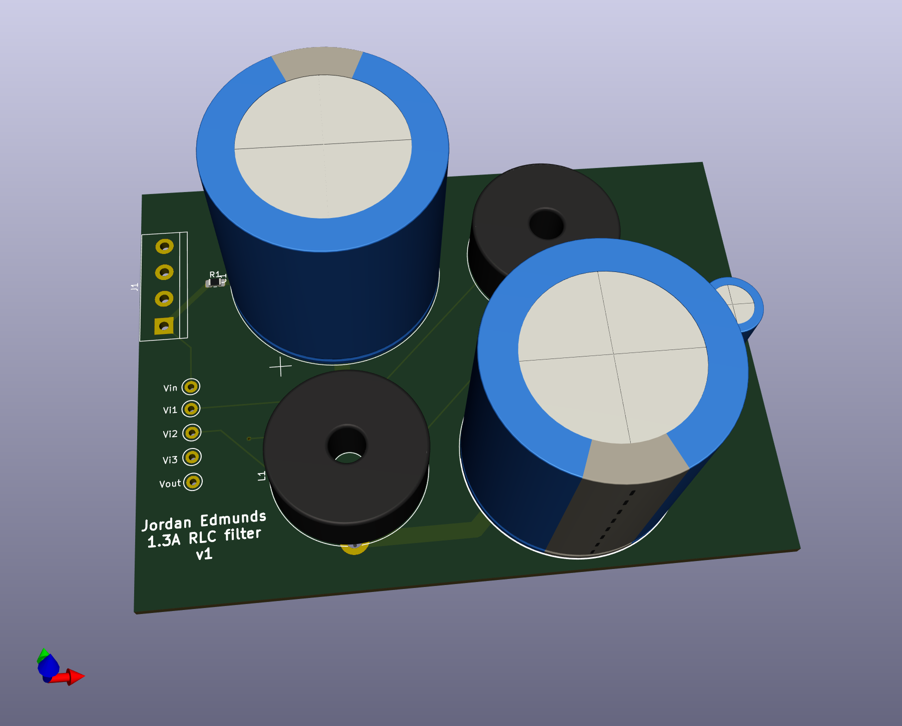
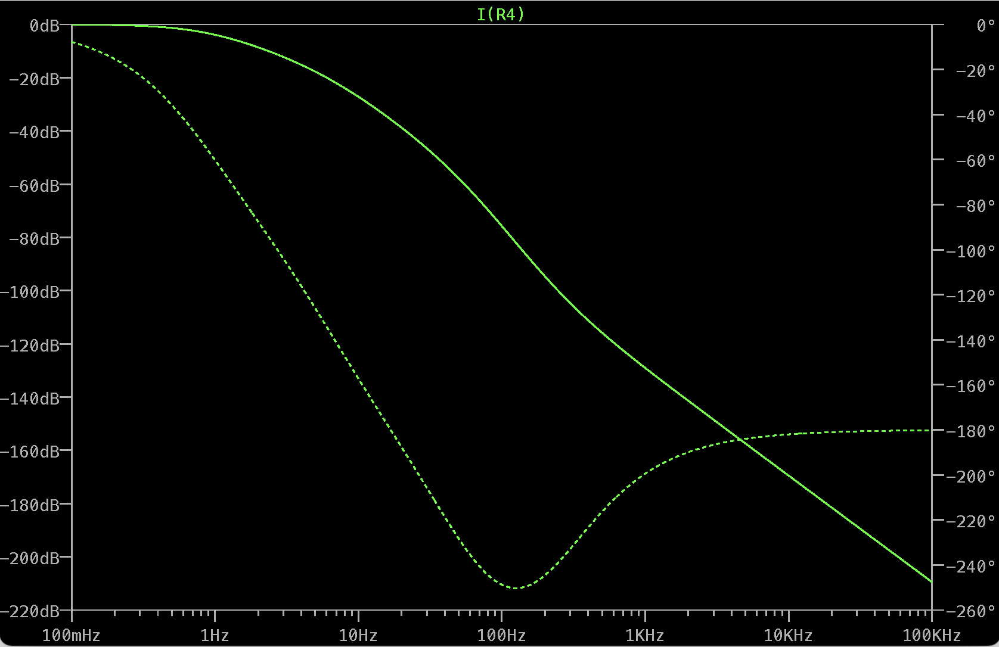
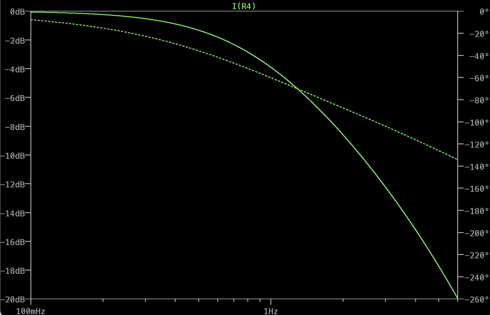

# LED Driver LC Filter

Filtering can provide shot-noise-limited performance from noisy drive electronics when driving LEDs with fixed currents. This LC filter is designed to aggressively lowpass filter an input current to a thorlabs LED to achieve shot-noise-limited output currents.

## Features
- Dual LC filter
- 1Hz -3dB frequency
- Shot-noise-limited performance at 1A drive current above 6Hz
- 1.3A maximum DC current (inductor-limited)
- Optional 0805 sense resistors at input and output
- Input screw terminal for connectorization to male M8-4 connector
- Output M8-4 female connector for connectorization to thorlabs LEDs

Fig 0. 3D kicad rendering of PCB

[Fabricated PCB]
Fig 1. Image of fabricated PCB

## Simulations
Simulations were done in LTSpice using manufacturer specified parasitic values for the series resistance of capacitors (10mOhm) and inductors (1.27Ohm). 10mOhm sense resistor values were used.

Fig 2. Filter response from 0.1Hz - 100kHz

Fig 3. Filter response from 0.1Hz - 6Hz (first 20dB of rolloff)

## Test Data
Initial tests indicate the Thorlabs LEDD1B has current noise >20dB in excess of the shot noise limit when driving LEDs at 1A.

[TO BE ADDED]
Fig 4. Measured transfer function of LCR filter from 0.1Hz - 10kHz

[TO BE ADDED]
Fig 5. Measured noise spectra without filter

[TO BE ADDED]
Fig 6. Measured noise spectra with filter in series
